# Voortgangbewaking - Portfol Project

## Overzicht
- **Project:** Portfol - Portfolio platform voor frontend developers
- **Team:** Fabio, Mika, Mike
- **Periode:** 21 dagen
- **Sprint duur:** 1 week
- **Daily stand-up:** 09:00 uur

---

## Sprint 1 (Dag 1-4)

### Sprint 1 Dag 1

#### Scrum Board Screenshot
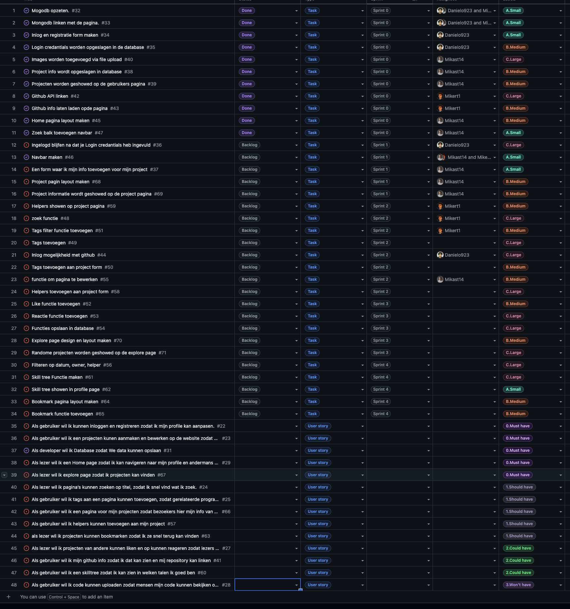

#### Toelichting keuzes
- **Keuze:** Begin van project week voor project week hebben we alvast gewerkt aan het project hierdoor zijn er al taken voltooid. Vandaag besproken we wat ieder ging maken en zijn aan de slag gegaan.
- **Reden:** De reden dat er al dingen zijn gemaakt buiten het project om is een communicatiefout binnen coach en leerlingen
- **Impact:** De impact hiervoor is dat we verder gaan met wat we al hebben en daardoor een groter project maken

---

### Sprint 1 Dag 2

#### Scrum Board Screenshot
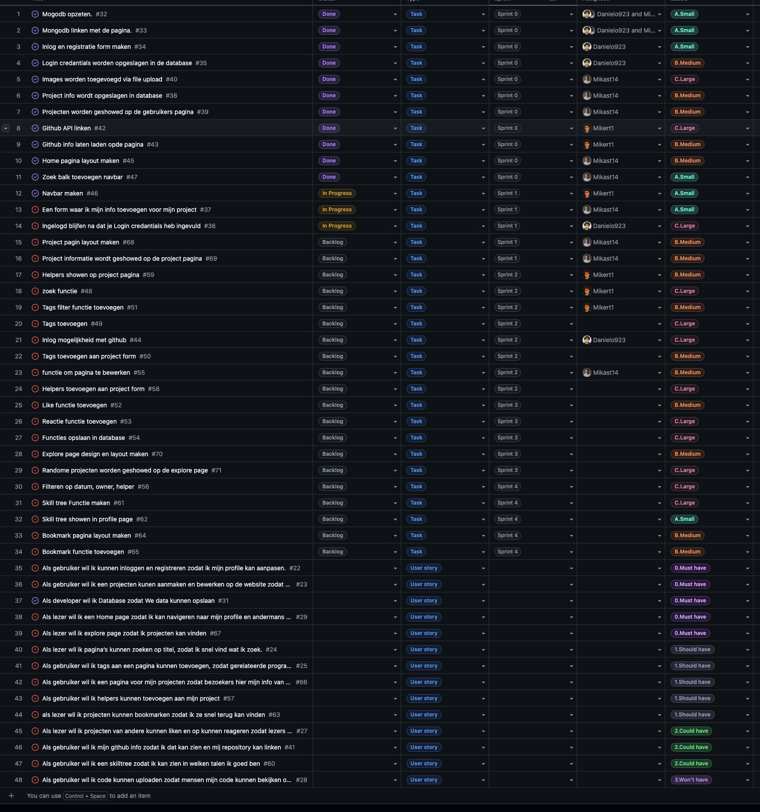

#### Toelichting keuzes
- **Keuze:** Vandaag is iedereen verder gegaan met waar ze gisteren mee zijn begonnen. Fabio is verder gegaan met login, Mike is verder gegaan met wat GitHub dingen en de navbar en Mika is gaan werken aan project form.
- **Reden:** De keuze is gemaakt omdat Fabio al meer gedaan heeft met login, en Mike nog niet tevreden was met de GitHub API. Voor Mika was het vooral verder gaan met het project om grote stappen te maken.
- **Impact:** De impact hiervan is dat het project er beter uit gaat zien door Mikes API en grote stappen worden gemaakt door Mika en Fabio.

---

### Sprint 1 Dag 3

#### Scrum Board Screenshot

#### Toelichting keuzes
- **Keuze:** Vandaag lag het project erg stil want Mike en Fabio waren ziek. Mika heeft ondertussen verder gewerkt aan de project aanmaken pagina en veel styling gedaan.
- **Reden:** Omdat Fabio en Mike ziek waren heeft Mika besloten om niet te grote stappen te gaan maken en heeft styling gedaan.
- **Impact:** De impact was dat het project stil lag

---

### Sprint 1 Dag 4

#### Scrum Board Screenshot

#### Toelichting keuzes
- **Keuze:** Mike en Fabio waren vandaag nog ziek. Mika heeft hierdoor weer aan styling en project aanmaken gewerkt
- **Reden:** De reden hiervoor was omdat Mike en Fabio nog steeds ziek waren
- **Impact:** [Wat betekent dit voor het project?]

---

## Sprint 2 (Dag 1-6)

### Sprint 2 Dag 1

#### Scrum Board Screenshot
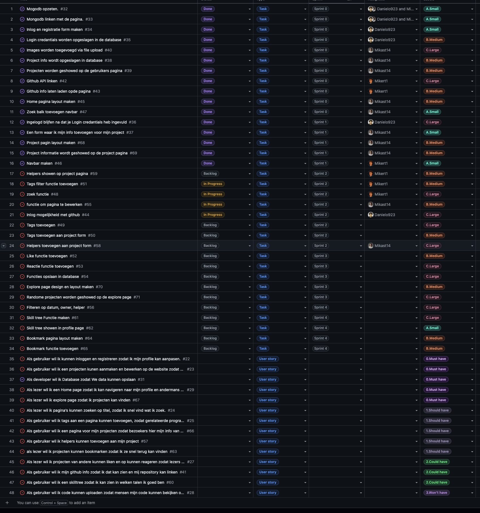

#### Toelichting keuzes
- **Keuze:** Iedereen was er vandaag weer. Mike is begonnen aan tags en zoekfunctie, Mika heeft de project aanmaken mogelijkheid helemaal af en is begonnen aan pagina bewerk mogelijkheid en Fabio probeert het mogelijk te maken om in te loggen via GitHub.
- **Reden:** We hebben deze keuzes gemaakt zodat Fabio de login kan gaan afmaken en Mike wat meer features aan het project toevoegt en voor Mika was zodat alles met projecten een stap dichterbij klaar kwam.
- **Impact:** Voor het project betekent dat er veel stappen gemaakt worden

---

### Sprint 2 Dag 2

#### Scrum Board Screenshot
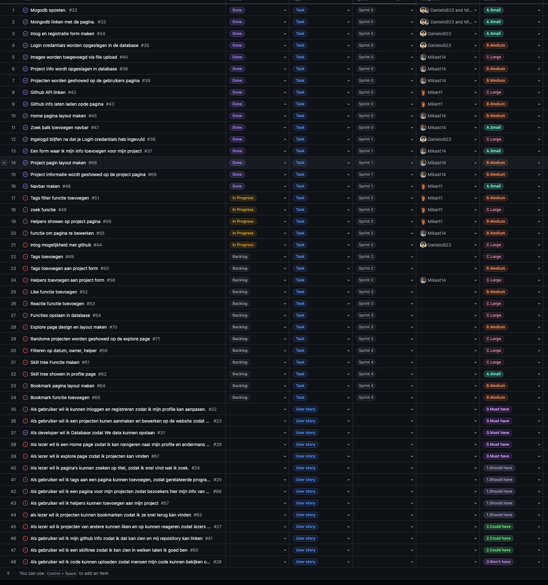

#### Toelichting keuzes
- **Keuze:** Iedereen ging verder met het ding van gisteren.
- **Reden:** Want gisteren is niks afgekomen.
- **Impact:** dat het project weer beetje vertraagd is

---

### Sprint 2 Dag 3

#### Scrum Board Screenshot
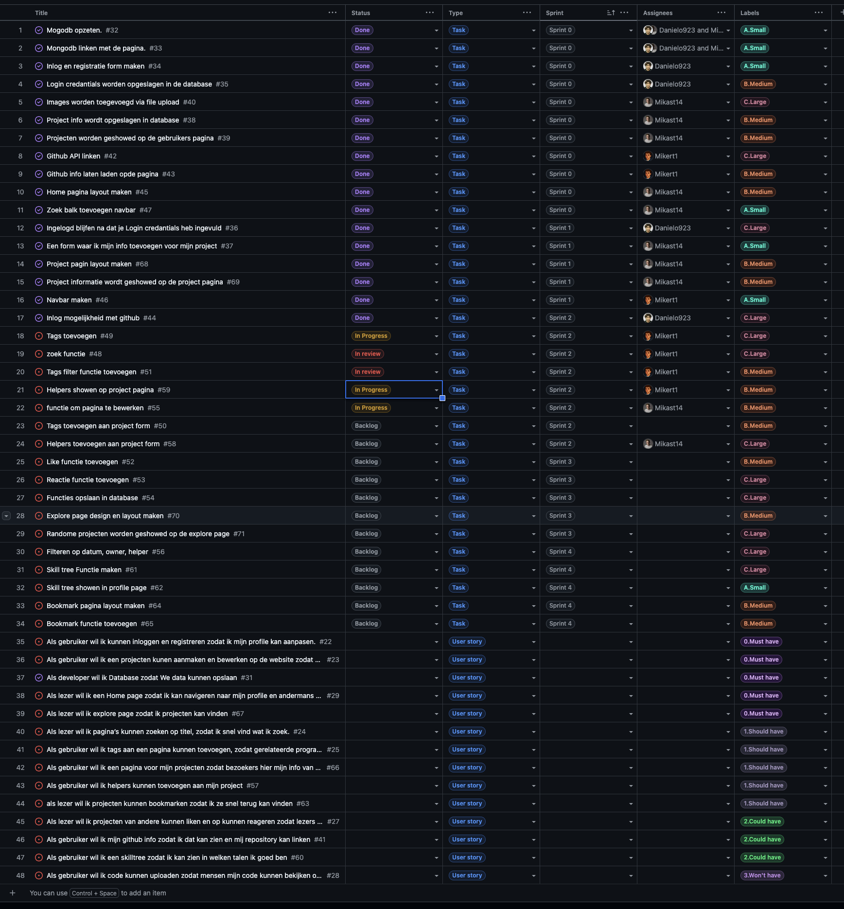

#### Toelichting keuzes
- **Keuze:** Fabio heeft issues gevonden in de GitHub login, Mike heeft veel kunnen afmaken gisteren en is Fabio gaan helpen. Mika is bezig met project bewerken pagina.
- **Reden:** Mika heeft veel moeite met dit onderdeel van het project. Fabio had hulp nodig met zijn issue dus Mike schoot te hulp.
- **Impact:** Er was weinig voortgang.

---

### Sprint 2 Dag 4

#### Scrum Board Screenshot

#### Toelichting keuzes
- **Keuze:** Fabio heeft nog steeds issues met de GitHub login. Mike is verder aan het gaan met tags en Mika heeft taken gereviewd.
- **Reden:** Mika heeft alleen kunnen nakijken omdat hij voor de rest heeft geholpen met issues. Mike heeft gewoon verder kunnen werken zodat er weer wat voortgang kwam.
- **Impact:** Er kwam weer wat voortgang bij maar staan nog steeds vast.

---

### Sprint 2 Dag 5

#### Scrum Board Screenshot
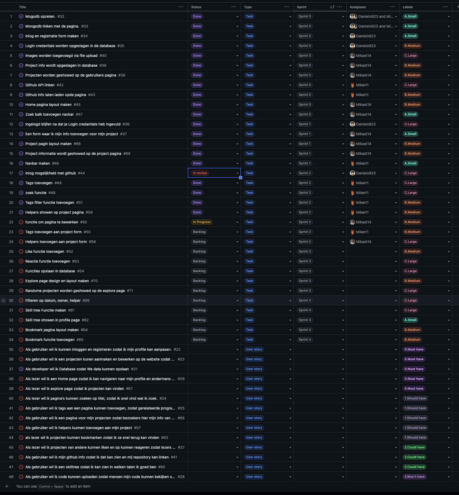

#### Toelichting keuzes
- **Keuze:** Fabio heeft zijn issue kunnen fixen en is de reactie functie gaan maken. Mika heeft de project edit page afgemaakt en Mike heeft Mika geholpen hierbij.
- **Reden:** Iedereen heeft meer voortgang kunnen boeken.
- **Impact:** Er was veel voortgang

---

### Sprint 2 Dag 6

#### Scrum Board Screenshot
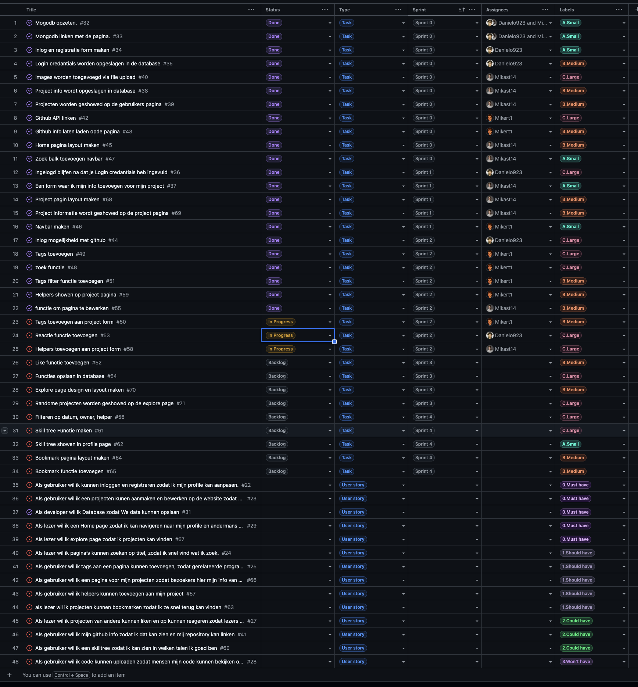

#### Toelichting keuzes
- **Keuze:** Iedereen is verder gegaan met waar hij mee bezig was.
- **Reden:** Omdat iedereen de functie van gisteren nog niet af had.
- **Impact:** Niet zo veel, we zijn gewoon verder gegaan.

---

## Sprint 3 (Dag 1-4)

### Sprint 3 Dag 1

#### Scrum Board Screenshot

#### Toelichting keuzes
- **Keuze:** Fabio was vandaag ziek en heeft hierdoor niet kunnen werken. Mika heeft de like functie toegevoegd en Mike is er voor aan het zorgen dat de projecten in een random volgorde komen.
- **Reden:** De reden is omdat we wilden focussen op de kleine projecten zodat Fabio niet veel mist.
- **Impact:** Dat we langzaam de kleine dingen afmaakten.

---

### Sprint 3 Dag 2

#### Scrum Board Screenshot
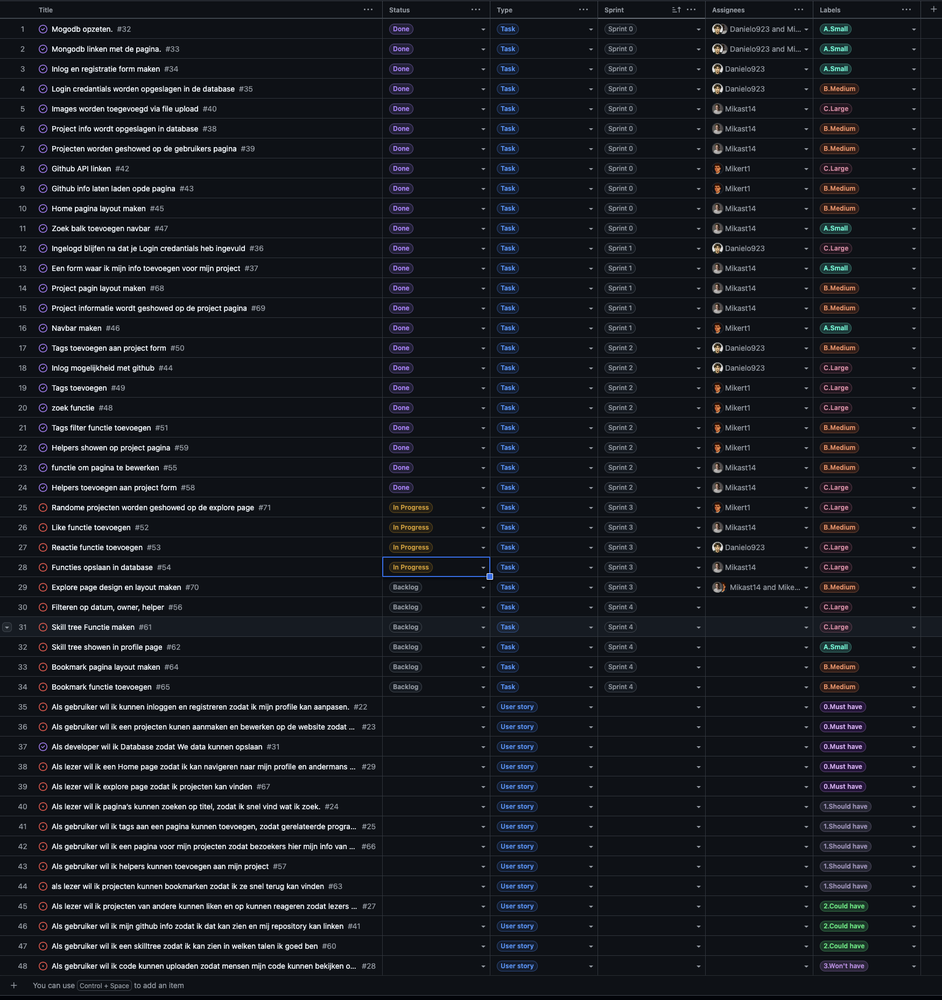

#### Toelichting keuzes
- **Keuze:** Vandaag was Fabio nog steeds ziek en hierdoor zijn Mike en Mika verder gegaan aan de dingen van gisteren.
- **Reden:** Omdat Fabio nog steeds ziek is en we nog niet klaar waren.
- **Impact:** Niet zoveel gewoon verder gegaan

---

### Sprint 3 Dag 3

#### Scrum Board Screenshot

#### Toelichting keuzes
- **Keuze:** Er is niets gedaan.
- **Reden:** We waren alle 3 ziek.
- **Impact:** Niet heel groot want er was al veel af en waren nog maar paar dingen te doen en hadden nog 2 sprints.

---

### Sprint 3 Dag 4

#### Scrum Board Screenshot
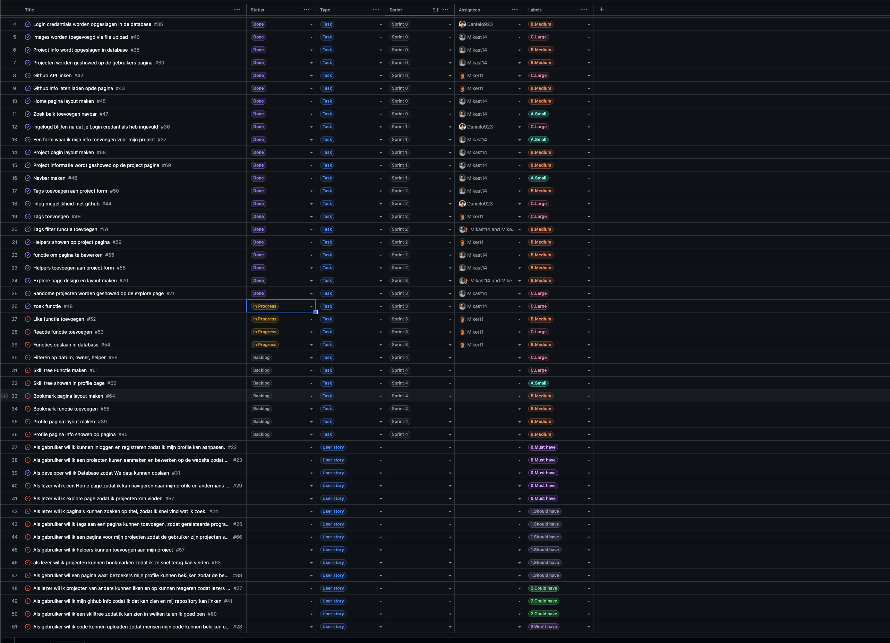

#### Toelichting keuzes
- **Keuze:** Mike en Mika hebben de laatste dingen van sprint 3 afgemaakt
- **Reden:** Fabio was nog ziek en het was de laatste dag van sprint 3. 
- **Impact:** Er was veel vooruitgang

---

## Sprint 4 (Dag 19-23)

### Sprint 4 Dag 1

#### Scrum Board Screenshot
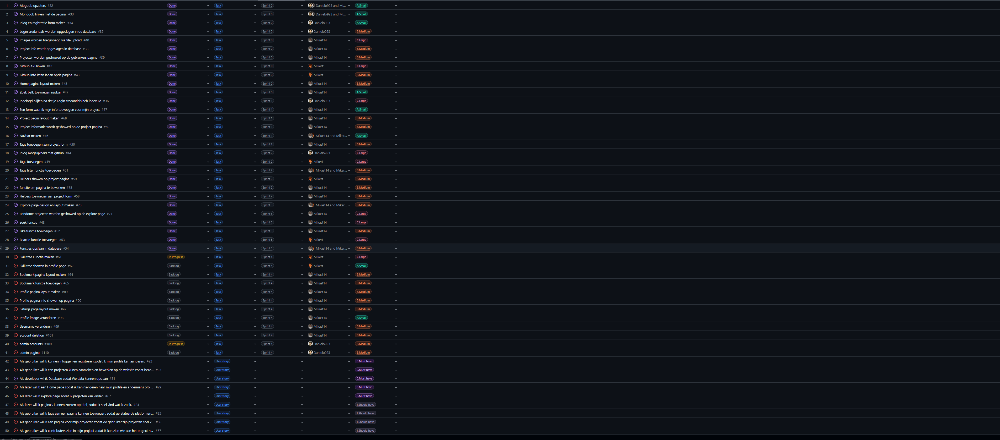

#### Toelichting keuzes
- **Keuze:** Zo veel mogelijk doen voor sprint 4 zodat het afkwam. Fabio pakte de admin page, Mike de skilltree en Mika heeft het scrumboard aangepast en heeft taken verdeeld.
- **Reden:** Fabio pakte het grootste onderdeel zodat hij meer functies kon schrijven. Mike de skilltree dat is nog wel belangrijk dingen en Mika wou meer overzicht hebben.
- **Impact:** Groot, we hadden meer overzicht wat we nog moesten doen en veel vooruitgang.

---

### Sprint 4 Dag 2

#### Scrum Board Screenshot
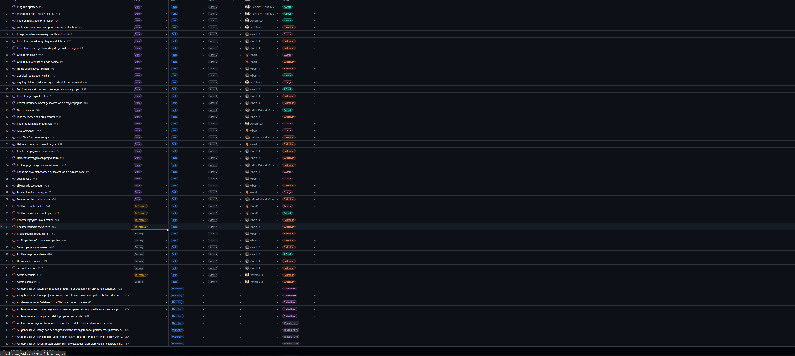

#### Toelichting keuzes
- **Keuze:** Mike ging verder aan skilltree en Fabio aan admin page. Mika begon met de bookmark pagina.
- **Reden:** Omdat Fabio en Mike nog niet klaar waren en Mika om meer voortgang te maken.
- **Impact:** Er was niet echt impact vandaag.

---

### Sprint 4 Dag 3

#### Scrum Board Screenshot
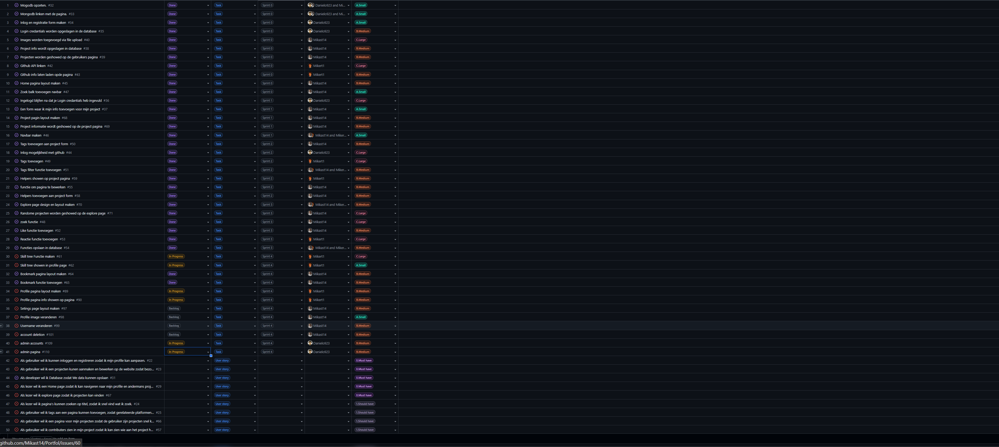

#### Toelichting keuzes
- **Keuze:** Mika was klaar met de bookmark pagina en maakte een klein begin aan profile pagina maar dit nam Mike uiteindelijk over nadat hij klaar was met de skilltree. Fabio ging verder.
- **Reden:** Mike was klaar en had niks te doen meer dus daarom de wissel. Fabio was nog niet klaar.
- **Impact:** [Wat betekent dit voor het project?]

---

### Sprint 4 Dag 4

#### Scrum Board Screenshot
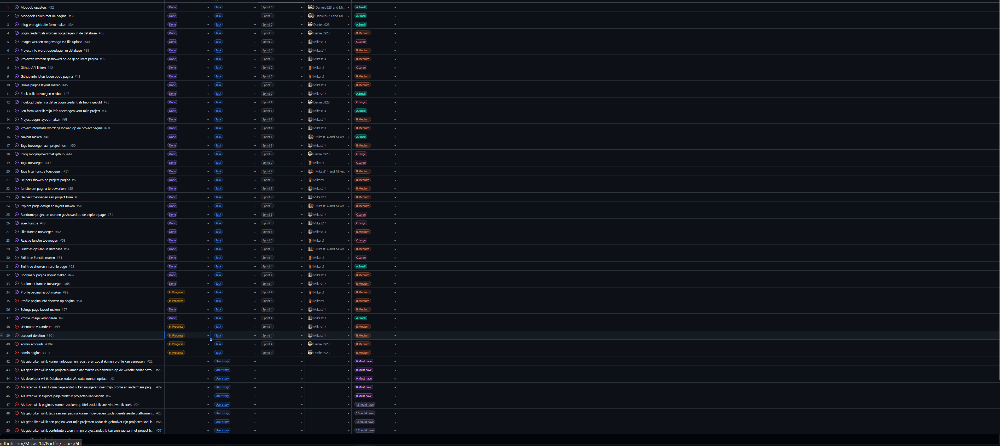

#### Toelichting keuzes
- **Keuze:** Vandaag waren de laatste taken gekozen en is alles bijna afgekomen.
- **Reden:** Er waren nog paar dingen te doen dus kozen we deze.
- **Impact:** Was er niet echt.

---

### Sprint 4 Dag 5

#### Scrum Board Screenshot
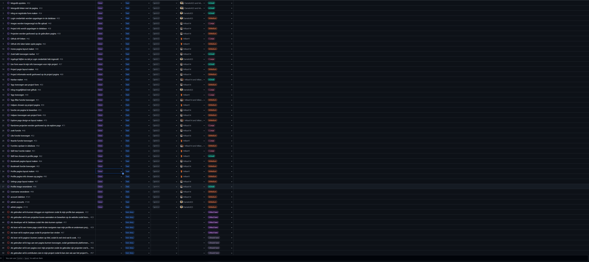

#### Toelichting keuzes
- **Keuze:** Alles is klaar dus we hebben vooral aan de extra dingen van het portfolio gewerkt en de laatste dingen gemaakt.
- **Reden:** We waren klaar dus was niet zo veel meer te doen.
- **Impact:** Groot, want we waren klaar.

---
